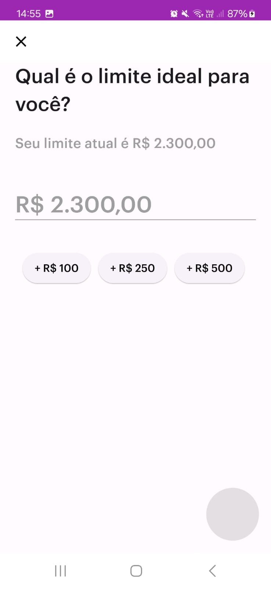

# 💳 Clone de Telas - Projeto Nubank

Este projeto tem como objetivo replicar telas do aplicativo **Nubank** usando **Dart**, oferecendo uma experiência interativa e próxima do visual do app original. O projeto inclui duas telas principais: **Tela de Limite de Cartão** e **Tela de Ajuste de Limite**.

## 📋 Índice
- [Descrição](#-descrição)
- [Tecnologias Utilizadas](#-tecnologias-utilizadas)
- [Telas do Projeto](#-telas-do-projeto)
   - [Tela 1: Limite de Cartão](#tela-1-limite-de-cartão)
   - [Tela 2: Ajuste de Limite](#tela-2-ajuste-de-limite)
- [Como Executar o Projeto](#-como-executar-o-projeto)
- [Contribuição](#-contribuição)
- [Licença](#-licença)

## 📄 Descrição

O projeto replica a experiência de navegação e interação de telas do **Nubank**. Atualmente, ele conta com duas telas principais, oferecendo funcionalidades como ajuste de limite de crédito e escolha do limite ideal.

## 🚀 Tecnologias Utilizadas

- **Dart**: Linguagem de programação principal do projeto.
- **Flutter** (Opcional): Para uma implementação completa no mobile.
- **Material Design**: Interface elegante e responsiva.

## 🖥️ Telas do Projeto

### Tela 1: Limite de Cartão

Nesta tela, o usuário pode visualizar o limite atual do cartão, o valor disponível e ajustar o limite de crédito usando um slider.

<div align="center">
  
</div>

#### Funcionalidades da Tela de Limite

- Exibir o **Limite Atual** e o **Limite Disponível**.
- Slider interativo para ajustar o limite de crédito.
- Exibir informações adicionais sobre o limite aprovado.
- Opção para acessar os **Limites Adicionais** e ajustar o limite para serviços como o NuPay.

---

### Tela 2: Ajuste de Limite

Ao clicar na opção "Limite aprovado no cartão", o usuário é levado a uma tela para escolher o limite ideal. Nesta tela, ele pode escolher o limite ideal ajustando o valor por meio de botões predefinidos ou inserindo um valor personalizado.

<div align="center">
  
</div>

#### Funcionalidades da Tela de Ajuste de Limite

- Exibir o limite atual e permitir ajustes automáticos com os botões de valores predefinidos (+ R$ 100, + R$ 250, + R$ 500).
- Campo de entrada de valor com formatação em Real, configurado para que o valor comece a ser digitado da direita para a esquerda.
- Classe de Formatação de Moeda: Foi criada uma classe dedicada para formatar o texto inserido pelo usuário em formato de moeda (R$), proporcionando uma experiência de entrada mais intuitiva e precisa
- Botão de confirmação no canto inferior direito, habilitado somente se o valor inserido for maior que o limite atual.

## 🛠️ Como Executar o Projeto

### Pré-requisitos

- Instale o **Dart SDK**: [Instalar Dart](https://dart.dev/get-dart).
- (Opcional) Se você estiver utilizando o **Flutter**, instale o SDK: [Instalar Flutter](https://flutter.dev/docs/get-started/install).

### Passos para executar:

1. Clone o repositório:
   ```bash
   git clone https://github.com/marcossbbatista/nuproject
   ```

2. Acesse a pasta do projeto:
   ```bash
   cd nuproject
   ```

3. Execute o projeto:
   ```bash
   dart run
   ```

Caso esteja utilizando o **Flutter**, use:
   ```bash
   flutter run
   ```

## 🤝 Contribuição

Contribuições são bem-vindas! Se você tiver sugestões de melhorias ou encontrar bugs, fique à vontade para abrir uma issue ou enviar um pull request.

1. Faça um **fork** do projeto.
2. Crie uma nova branch com as suas modificações: `git checkout -b minha-feature`.
3. Faça o **commit** das suas mudanças: `git commit -m 'Minha nova feature'`.
4. Faça o **push** para a branch: `git push origin minha-feature`.
5. Abra um **Pull Request** para análise.

## 📜 Licença

Este projeto está licenciado sob a licença MIT - consulte o arquivo [LICENSE](LICENSE) para mais detalhes.
