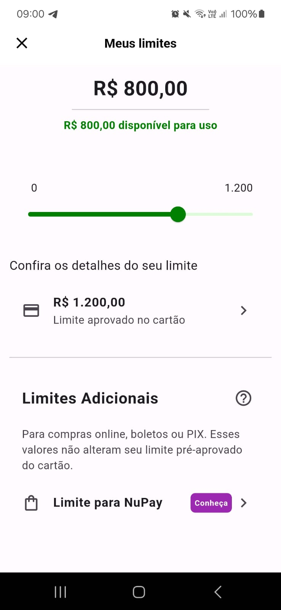

# 💳 Tela de Limite de Cartão - Nubank

Este projeto tem como objetivo replicar a tela de **Limite de Cartão** do famoso **Nubank** utilizando a linguagem **Dart**. A interface foi projetada para se assemelhar ao layout original, proporcionando uma experiência interativa e visual agradável para o usuário.

## 📋 Índice
- [Descrição](#-descrição)
- [Tecnologias Utilizadas](#-tecnologias-utilizadas)
- [Funcionalidades](#-funcionalidades)
- [Como Executar o Projeto](#-como-executar-o-projeto)
- [Contribuição](#-contribuição)
- [Licença](#-licença)

## 📄 Descrição

Neste projeto, recriamos a tela de **Limite de Cartão** do Nubank, que permite ao usuário visualizar e ajustar o limite disponível do cartão de crédito. O design segue uma abordagem simples e moderna, inspirada na interface real do aplicativo Nubank.

<div style="text-align: center;">
  
</div>

O projeto utiliza **Dart** como linguagem principal, focando em uma arquitetura bem organizada e modular para facilitar a manutenção e extensão do código.

## 🚀 Tecnologias Utilizadas

- **Dart**: Linguagem de programação utilizada para desenvolver a interface e lógica do projeto.
- **Flutter** (Opcional): Caso queira uma implementação completa no mobile, a tela pode ser adaptada para Flutter com widgets nativos.
- **Material Design**: Para uma interface elegante e responsiva.

## 🔧 Funcionalidades

- Exibir o **Limite Atual** e o **Limite Disponível**.
- Slider interativo para ajustar o valor do limite de crédito.
- Exibir **informações detalhadas** sobre o uso do limite.
- **Feedback visual** dinâmico ao ajustar o limite.
  
### Exemplo de Layout da Tela:
A tela segue uma estrutura com os seguintes componentes principais:

1. **Título**: "Limite do Cartão".
2. **Slider**: Para ajustar o limite.
3. **Informações**: Mostrando o limite disponível e o total do limite.

## 🛠️ Como Executar o Projeto

### Pré-requisitos

- Instale o **Dart SDK**: [Instalar Dart](https://dart.dev/get-dart).
- (Opcional) Se você estiver utilizando o **Flutter**, instale o SDK: [Instalar Flutter](https://flutter.dev/docs/get-started/install).

### Passos para executar:

1. Clone o repositório:
   ```bash
   git clone https://github.com/seu-usuario/nubank-card-limit-clone.git
   ```
   
2. Acesse a pasta do projeto:
   ```bash
   cd nubank-card-limit-clone
   ```

3. Execute o projeto:
   ```bash
   dart run
   ```

Caso esteja utilizando o **Flutter**, use:
   ```bash
   flutter run
   ```

## 🤝 Contribuição

Contribuições são bem-vindas! Se você tiver sugestões de melhorias ou encontrar bugs, fique à vontade para abrir uma issue ou enviar um pull request.

1. Faça um **fork** do projeto.
2. Crie uma nova branch com as suas modificações: `git checkout -b minha-feature`.
3. Faça o **commit** das suas mudanças: `git commit -m 'Minha nova feature'`.
4. Faça o **push** para a branch: `git push origin minha-feature`.
5. Abra um **Pull Request** para análise.

## 📜 Licença

Este projeto está licenciado sob a licença MIT - consulte o arquivo [LICENSE](LICENSE) para mais detalhes.
